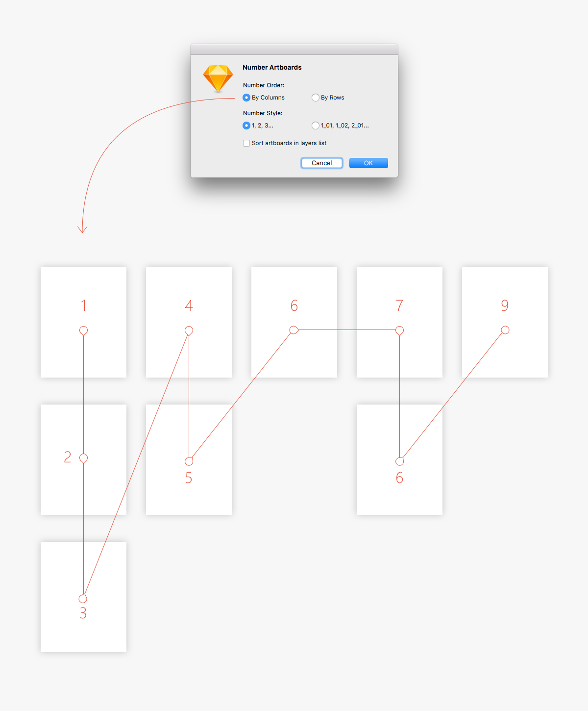
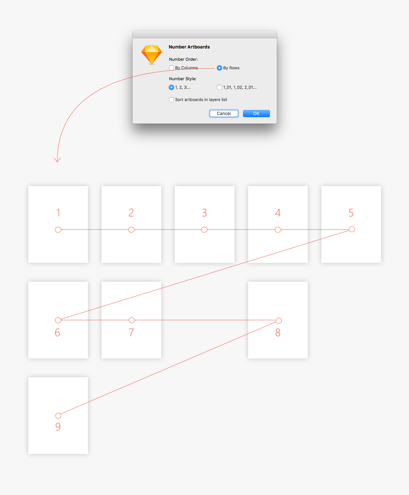

# sketch-number-artboards
Sketch plugin to number and sort artboards in layers list.

## How it works

#### Number Artboards
Add number at beginning of artboard name.

Plugin chooses number for artboard according its location on the canvas. If artboard already has a number, plugin refreshes it.

There is two numbering mode:

1. By columns

2. By rows

#### Sort Artboards in Layers List
Simply sort artboards in layer list by its canvas position.

## How to use
1. Select artboards
2. Run plugin
